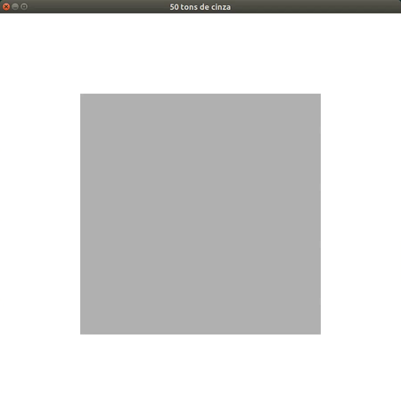

# Animando uma cor



Características:
  - 2D
  - glOrtho
  - animação de cor
  - modo imediatista

## Objetivo

Ilustrar como fazer uma animação ao alterar o valor de uma variável de estado
da cena - no caso, a cor de um quadrado - ao longo do tempo usando
o evento `timer` registrado com `glutTimerFunc(...)`.

## Descrição

Uma animação é a alteração de algum valor que é feita ao longo do tempo. Logo,
precisamos de uma forma para fazer esse ajuste ao longo de vários quadros.

Para tanto, podemos usar tanto o evento `timer` (de `glutTimerFunc(...)`),
quanto o `idle` (de `glutIdleFunc(...)`). Este exemplo utiliza o `timer` porque
ele é mais simples para definir a taxa de atualização dos quadros (FPS).
Contudo, para ter mais flexibilidade e atingir um FPS maior, é indicado o uso
de `idle`.

Para usar o `timer`, a função principal registra uma _callback_
`void mudaCor(...)`, que vai ficar sendo chamada a cada 33ms, para que tenhamos
30 FPS (1000ms / 33ms ≈ 30 FPS). Repare que a _callback_ é registrada em
`int main(...)`, mas a própria função precisa se re-registrar para que seja
chamada continuamente (`glutTimerFunc` é um _"one-time call"_):

```c
int main(int argc, char* argv[]) {
    // ...
    glutTimerFunc(0, mudaCor, 33);
    // ...
}
```

```c
void mudaCor(int periodo) {
    // ...
    // faz coisas para mudar a cor...
    // ...
    glutTimerFunc(periodo, mudaCor, periodo);
}
```

A função de desenho define a cor de desenho para um tom de cinza utilizando
o valor (entre 0 e 1) que está em uma variável global:

```c
float tom = 0.5f;

void desenhaCena() {
    // ...
    glColor3f(tom, tom, tom);

    glBegin(GL_TRIANGLE_FAN);
        glVertex3f(20, 20, 0);
        // ...
}
```

É importante que a função de desenho NUNCA altere o estado da aplicação: ela
deve apenas desenhar a aplicação NO ESTADO ATUAL. Fica a cargo de outras
_callbacks_, como a registrada em `glutTimerFunc(...)` neste caso, alterar
o estado do programa (o valor de `float tom`).
