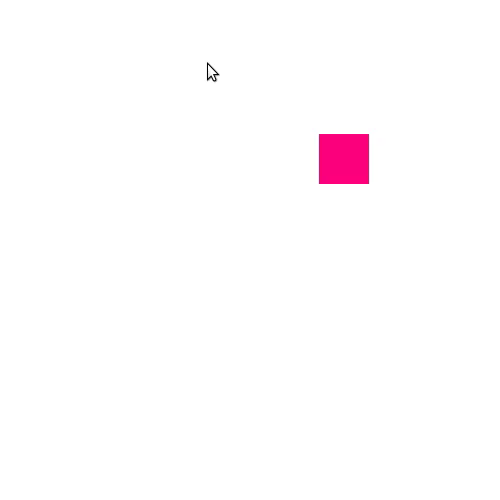

# Animando uma posição



Características:
  - 2D
  - glOrtho
  - animação de posição
  - movimento do mouse
  - modo imediatista

## Objetivo

Mostrar a animação da posição de um objeto na cena. Sua posição é alterada
de acordo com a posição do mouse dentro da janela.

## Descrição

Esta aplicação mantém duas variáveis globais:
1. Posição do quadrado (`struct ponto posicaoQuadrado`)
1. Posição do mouse (`struct ponto posicaoMouse`)

Assim que a freeglut identifica que o mouse foi movimentado, ela chama
a _callback_ `movimentoMouse(...)` (registrada para `glutPassiveMotionFunc`)
que apenas atualiza a posição do mouse na variável global `posicaoMouse`:

```c
// Callback de evento de movimento do mouse
void movimentoMouse(int x, int y) {
    posicaoMouse.x = x;
    posicaoMouse.y = y;
}
```

Além desse evento, a aplicação também mantém uma _callback_ `atualizaCena(...)`
sendo chamada a 30 FPS (por meio de `glutTimerFunc`) que atualiza a posição
do quadrado baseada na posição atual do quadrado e do mouse:

```c
// Callback do evento timer
void atualizaCena(int periodo) {
    // faz o quadrado andar na direção do ponteiro
    posicaoQuadrado.x += (posicaoMouse.x - posicaoQuadrado.x)/50.0f;
    posicaoQuadrado.y += (posicaoMouse.y - posicaoQuadrado.y)/50.0f;

    // Pede ao GLUT para redesenhar a tela, assim que possível
    glutPostRedisplay();

    // Se registra novamente, para que fique sempre sendo chamada (30 FPS)
    glutTimerFunc(periodo, atualizaCena, periodo);
}
```

Repare nas linhas que estão alterando o valor (x,y) da variável
`posicaoQuadrado`. Elas estão somando um "tantinho" na posição atual
(por causa do `+=`) de maneira a aproximá-la à posição do mouse. Esse tantinho
é equivalente a 1/50 da distância atual entre o quadrado e o mouse. Com essa
fórmula, o efeito obtido é que o quadrado começa rápido e termina devagar,
afinal, 1/50 de uma distância grande dá um número maior (logo, mais rápido)
do que 1/50 de uma distância curtinha.

A função de desenho define a posição onde o quadrado será desenhado utilizando
o valor (x,y) que está armazenado em `posicaoQuadrado` no momento do desenho:

```c
struct ponto posicaoQuadrado;

void desenhaCena() {
    // ...
    // Começa a desenhar um polígono com os vértices especificados
    // ATENÇÃO: esta não é a melhor forma para movimentar um objeto
    //          veremos na aula sobre "Transformações" a melhor forma
    //          basicamente, vamos "desenhar o objeto na origem" e transladá-lo para sua posição
    glBegin(GL_TRIANGLE_FAN);
        glVertex3f(posicaoQuadrado.x, posicaoQuadrado.y, 0);
        glVertex3f(posicaoQuadrado.x + tamanhoQuadrado.largura, posicaoQuadrado.y, 0);
        glVertex3f(posicaoQuadrado.x + tamanhoQuadrado.largura, posicaoQuadrado.y + tamanhoQuadrado.altura, 0);
        glVertex3f(posicaoQuadrado.x, posicaoQuadrado.y + tamanhoQuadrado.altura, 0);
    glEnd();
    // ...
}
```

A forma mais adequada para desenhar um objeto em uma certa posição é
transladar a origem para onde ele deve ser desenhado e, então, desenhá-lo
especificando seus vértices como se ele estivesse na origem. Este exemplo,
usando esse recurso de transformações geométricas, ficaria assim:

```c
struct ponto posicaoQuadrado;

void desenhaCena() {
    // ...
    //
    glPushMatrix();
        glTranslatef(posicaoQuadrado.x, posicaoQuadrado.y, 0);
        glBegin(GL_TRIANGLE_FAN);
            glVertex3f(0, 0, 0);
            glVertex3f(tamanhoQuadrado.largura, 0, 0);
            glVertex3f(tamanhoQuadrado.largura, tamanhoQuadrado.altura, 0);
            glVertex3f(0, tamanhoQuadrado.altura, 0);
        glEnd();
    glPopMatrix();
    // ...
}
```

É importante que a função de desenho NUNCA altere o estado da aplicação: ela
deve apenas desenhar a aplicação NO ESTADO ATUAL. Fica a cargo de outras
_callbacks_, como a registrada em `glutTimerFunc(...)` neste caso, alterar
o estado do programa (o valor de `posicaoQuadrado`).
