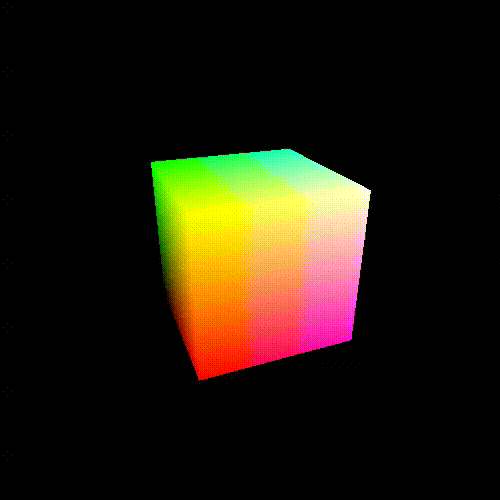

# Cubo



Um cubo colorido em rotação constante em torno do eixo y.

Características:
  - 3D
  - glFrustum/gluPerspective
  - animação de rotação
  - objetos em arrays
  - marcador de FPS
  - mantém razão de aspecto
  - modo imediatista

## Objetivo

Ilustrar a criação de um cubo, um objeto 3D simples, formado pela criação de
6 faces, cada uma com 2 triângulos.

## Descrição

Cada vértice do cubo possui uma cor e o cubo está girando ao redor de seu eixo
y com uma velocidade constante.

Este exemplo ilustra como construir um cubo usando GL_TRIANGLES, sendo
necessário especificar 36 x `glVertex`. Além da definição das coordenadas
de cada vértice, são definidos também a sua cor e o seu vetor normal (que não
é de fato usado neste exemplo, pois não há iluminação dinâmica).

Como são 36 vértices/cores/normais, optou-se por usar um vetor (_array_)
para conter todas as coordenadas, outro para todas as cores e outro para todas
as coordenadas dos vetores normais. Aí, para desenhar o cubo, percorremos
esses _arrays_ dentro de `glBegin...glEnd`:

```c
void desenhaCubo() {
    // o cubo tem 36 vértices definidos.
    // cada vértice tem x,y,z, logo, são 108 valores (36 x 3)
    // NUM_VALORES = 108
    const int NUM_VALORES = sizeof(verticesCubo) / sizeof(GLfloat);

    glBegin(GL_TRIANGLES);
      int c;
      for (c = 0; c < NUM_VALORES; c += 3) {
          glNormal3f(normaisCubo[c], normaisCubo[c+1], normaisCubo[c+2]);
          glColor3f(coresCubo[c], coresCubo[c+1], coresCubo[c+2]);
          glVertex3f(verticesCubo[c], verticesCubo[c+1], verticesCubo[c+2]);
      }
    glEnd();
}
```

**Nota de implementação 1**: colocar os "dados sobre os vértices" em _arrays_
é uma ótima ideia porque (a) melhora o desempenho e (b) é necessário para
outras formas de melhorar o desempenho de maneiras estratosféricas.

O (a) desempenho melhora porque um _array_ ocupa um espaço contíguo na RAM e
isso permite o processador aproveitar a
[localidade de referência espacial][localidade-referencia]. Por exemplo,
quando o processador vai ler da RAM um vértice para jogar para a placa de vídeo
desenhar, as informações desse vértice podem já ter sido carregadas para a
sua cache (uma memória ultra rápida dentro do processador), visto que o
processador sempre lê vários valores ao mesmo tempo, não apenas 1.

Contudo, ainda é possível (b) melhorar o desempenho ainda mais. Esses _arrays_
estão ocupando espaço na RAM, mas poderíamos pedir à placa de vídeo para colocar
na VRAM (Video RAM), tornando o programa muito mais eficiente. Este exemplo não
mostra como isso pode ser feito, mas o [vbo-cubo](../vbo-cubo) sim.

**Nota de implementação 2**: lembre-se de que existe o `glVertex3f(x,y,z)`,
que tem um primo chamado `glVertex3fv(array)`, que recebe um _array_ que aponta
para 3 _floats_. Se quiséssemos, poderíamos simplificar o código ao usar
`glVertex3fv(array)` da seguinte forma:

```c
glBegin(GL_TRIANGLES);
  int c;
  for (c = 0; c < NUM_VALORES; c += 3) {
      glNormal3fv(&normaisCubo[c]);
      glColor3fv(&coresCubo[c]);
      glVertex3fv(&verticesCubo[c]);
  }
glEnd();
```

[localidade-referencia]: https://en.wikipedia.org/wiki/Locality_of_reference
