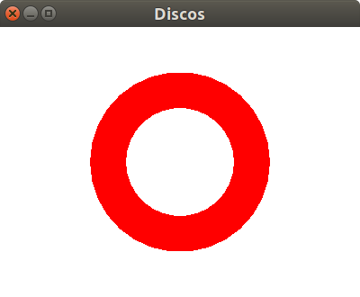
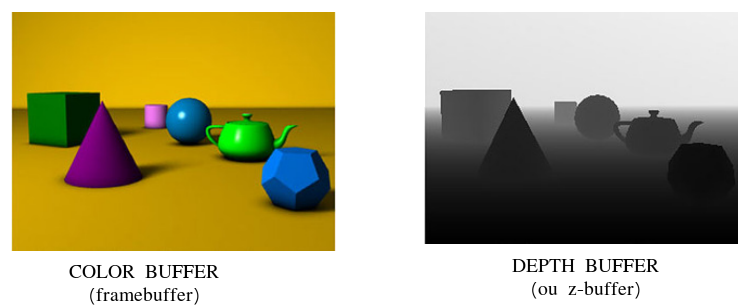

# Discos



Um ambiente para mostrar como o OpenGL determina visibilidade de objetos.

Características:
  - 2D
  - glOrtho
  - z-buffer
  - modo imediatista

## Objetivo

Mostrar que, por padrão, o OpenGL não utiliza o valor das coordenadas Z para
determinar visibilidade de objetos (quem está na frente de quem) - ele
usa o algoritmo do pintor, em que o que foi desenhado por último fica na frente
dos demais.

## Descrição

O exemplo mostra um disco vermelho que foi criado ao desenhar um círculo
vermelho grande, depois um branco menor dentro dele.

Ao alterar a ordem de desenho dos dois discos, o branco some (porque o OpenGL
desenhou o vermelho, maior, por cima do branco).

Uma primeira ideia é alterar a coordenada z do círculo branco para 1, pra que
ele seja desenhado na frente do vermelho. Contudo, o branco continua não
aparecendo. O motivo: por padrão, o OpenGL não considera as coordenadas z dos
objetos para determinar quem está na frente de quem.

Para ter a visibilidade correta, precisamos:
1. Solicitar um _depth buffer_ à freeglut quando criarmos a janela
   ```c
   glutInitDisplayMode(GLUT_RGB | GLUT_SINGLE | GLUT_DEPTH);
   ```
1. Habilitar o teste de profundidade, que faz o OpenGL olhar para as
   coordenadas z para determinar visibilidade
   ```c
   glEnable(GL_DEPTH_TEST);
   ```
1. Limpar o _depth buffer_ sempre que limparmos o _color buffer_ na função
   de desenho
   ```c
   glClear(GL_COLOR_BUFFER_BIT | GLUT_DEPTH_BUFFER_BIT);
   ```

### _Depth buffer_ (ou _z-buffer_)

O _depth buffer_ é uma imagem com as mesmas dimensões do _color buffer_ que
armazena um valor entre 0 e 1 para cada pixel do _color buffer_ e
indica que a distância da câmera (ou profundidade) até o objeto
mais próximo visível naquele pixel:
- Um **pixel preto** tem valor próximo de 0 e indica que o objeto está bem perto
  da câmera
- Um **pixel branco** tem valor 1 e indica distância máxima da câmera

Veja uma imagem mostrando tanto o _color buffer_ quanto o _z-buffer_ de uma
cena:


