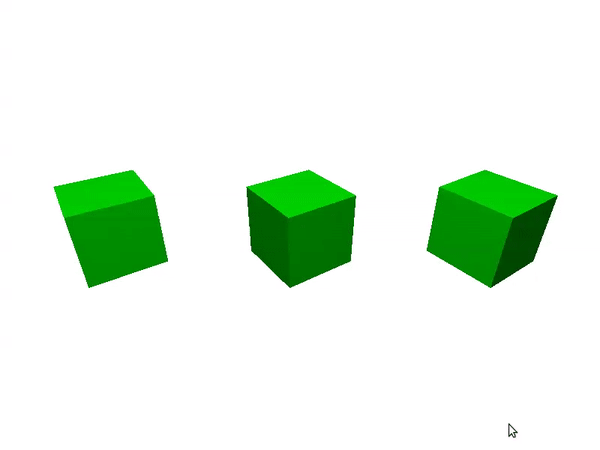

# _Shaders_: _flat_, Gouraud e Phong



Um programa que renderiza 3x{esferas, quadrados, cubos} usando sombreadores
{constante, Gouraud, Phong}, com variação para o modelo Blinn-Phong.

Características:
  - 3D
  - glFrustum/gluPerspective
  - animação de rotação
  - objetos em arrays
  - marcador de FPS
  - mantém razão de aspecto
  - _vertex arrays_
  - _vertex buffer objects_ (vbos)
  - _shaders_
  - modelos de iluminação
  - modelagem de esferas
  - modelagem de cubos
  
## Objetivo

Mostrar como criar uma aplicação que usa VBOs e _shaders_, com diferentes
_shaders_ sendo usados ao mesmo tempo.

## Descrição

Este exemplo mostra uma cena com 3 cubos, esferas ou quadrados (aperte
tecla <key>espaço</key> para alternar) sendo renderizados usando _shaders_
de iluminação constante (_flat_) à esquerda, Gouraud (interpolação de cores)
ao meio e Phong (interpolação de normais, definição de cor por fragmento )
à direita.

Ele usa recursos da linguagem C++ (logo, a extensão `.cpp` dos arquivos) e
a funcionalidade de carregar e usar _shaders_ está no módulo `shader.cpp/.h`,
que possui uma classe `Shader` com essa funcionalidade.

O modelo de iluminação usado é o de Phong, mas ele pode ser alterado para
usar a variação Blinn-Phong ao pressionar a tecla <kbd>i</kbd>.

Nos _shaders_ constante e Gouraud, o _vertex shader_ faz duas coisas: (1)
recebe os atributos de cada vértice (coordenadas, normal e cor),
encontra a coordenada transformada por `projecao` e `modeloVisualiacao` e
a passa para o _fragment shader_; e (b) calcula a cor do vértice de acordo
com uma fonte de luz posicional cuja posição e cor está definida como uma
variável `uniform` do _shader_.

```glsl
#version 460 core
#pragma debug(on)
#pragma optimize(off)

layout(location=0) in vec3 coordenada;
layout(location=1) in vec3 normal;
layout(location=2) in vec4 cor;

uniform mat4 projecao;
uniform mat4 modeloVisualizacao;
uniform vec3 posicaoLuz;
uniform vec3 corLuz;
uniform bool blinnPhong;

flat out vec4 corMisturada;

struct Material {
    float coeficienteAmbiente;
    float coeficienteDifuso;
    float coeficienteEspecular;
    float expoenteEspecularidade;
};

void main() {
    Material material = Material(0.05, 0.8, 1.0, 50);


    vec3 coordenadaNoMundo = (modeloVisualizacao * vec4(coordenada, 1.0)).xyz;
    gl_Position = projecao * vec4(coordenadaNoMundo, 1.0);

    // acha a distância da fonte de luz até o vértice, considerando
    // que a posição dela está dada em relação ao sistema do mundo (sem modelView)
    vec3 pontoAteLuz = posicaoLuz- coordenadaNoMundo;
    float distanciaAteLuz = length(pontoAteLuz);
    pontoAteLuz = normalize(pontoAteLuz);

    // pega a normal do vértice e a transforma (inversa da transposta)
    vec3 normalTransformada = normalize(transpose(inverse(mat3(modeloVisualizacao))) * normal);

    // acha o vetor visualização e o halfway, que é o meio do caminho
    // entre visualização e incidência
    vec3 visualizacao = normalize(-coordenadaNoMundo);
    vec3 meioDoCaminho = normalize(pontoAteLuz + visualizacao);
    vec3 reflexaoLuz = normalize(reflect(-pontoAteLuz, normalTransformada));

    // acha a cor da luz atenuada
    vec3 corDaLuzAtenuada = (1/(1 + distanciaAteLuz * 0.005 + pow(distanciaAteLuz, 2) * 0.0001)) * corLuz;

    // calcula as componentes ambiente, difusa, especular
    vec3 ambiente = cor.rgb * material.coeficienteAmbiente;
    vec3 difusa = max(0, dot(pontoAteLuz, normalTransformada)) * corDaLuzAtenuada * cor.rgb * material.coeficienteDifuso;
    vec3 especular;
    if (blinnPhong == true) {
        especular = pow(max(0, dot(meioDoCaminho, normalTransformada)), material.expoenteEspecularidade) * corDaLuzAtenuada * material.coeficienteEspecular;
    } else {
        especular = pow(max(0, dot(reflexaoLuz, visualizacao)), material.expoenteEspecularidade) * corDaLuzAtenuada * material.coeficienteEspecular;
    }

    vec3 corResultante = ambiente + difusa + especular;
    // correção gamma
    vec3 corResultanteCorrigida = pow(corResultante, vec3(1.0/2.2));

    corMisturada = vec4(corResultanteCorrigida, 1.0);
}
```

O _fragment shader_, por sua vez, recebe apenas a cor interpolada dos vértices
do triângulo de que este fragmento faz parte e define a cor de saída como
essa cor de entrada interpolada:

```glsl
#version 460 core
#pragma debug(on)
#pragma optimize(off)

in vec4 corMisturada;
// flat in vec4 corMisturada // no caso do flat-fragment.glsl

out vec4 corFinal;

void main() {
    corFinal = corMisturada;
}
```

No caso do _shader_ de Phong, o _vertex shader_ apenas calcula a interpolação
do vetor normal dos vértices para que o _fragment shader_ faça todo o cálculo
de iluminação, para cada fragmento:

O _vertex shader_:

```glsl
#version 460 core
#pragma debug(on)
#pragma optimize(off)

layout(location=0) in vec3 coordenada;
layout(location=1) in vec3 normal;
layout(location=2) in vec4 cor;

uniform mat4 projecao;
uniform mat4 modeloVisualizacao;


out vec3 coordenadaNoMundo;
out vec3 normalTransformada;
out vec4 corMisturada;

void main() {
    vec4 coordenadaTransformada = (modeloVisualizacao * vec4(coordenada, 1.0));
    gl_Position = projecao * vec4(coordenadaTransformada.xyz, 1.0);

    coordenadaNoMundo = coordenadaTransformada.xyz / coordenadaTransformada.w;

    // pega a normal do vértice e a transforma (inversa da transposta)
    normalTransformada = normalize(transpose(inverse(mat3(modeloVisualizacao))) * normal);

    // passa a cor para o fragment shader
    corMisturada = cor;
}
```

O _fragment shader_:

```glsl
#version 460 core
#pragma debug(on)
#pragma optimize(off)

in vec4 corMisturada;
in vec3 coordenadaNoMundo;
in vec3 normalTransformada;

uniform vec3 posicaoLuz;
uniform vec3 corLuz;
uniform bool blinnPhong;

out vec4 corFinal;

struct Material {
    float coeficienteAmbiente;
    float coeficienteDifuso;
    float coeficienteEspecular;
    float expoenteEspecularidade;
};


void main() {
    Material material = Material(0.05, 0.8, 1.0, 50);
    vec3 normal = normalize(normalTransformada);

    // acha a distância da fonte de luz até o vértice, considerando
    // que a posição dela está dada em relação ao sistema do mundo (sem modelView)
    vec3 pontoAteLuz = posicaoLuz- coordenadaNoMundo;
    float distanciaAteLuz = length(pontoAteLuz);
    pontoAteLuz = normalize(pontoAteLuz);

    // acha o vetor visualização e o halfway, que é o meio do caminho
    // entre visualização e incidência
    vec3 visualizacao = normalize(-coordenadaNoMundo);
    vec3 meioDoCaminho = normalize(pontoAteLuz + visualizacao);
    vec3 reflexaoLuz = normalize(reflect(-pontoAteLuz, normalTransformada));

    // acha a cor da luz atenuada
    vec3 corDaLuzAtenuada = (1/(1 + distanciaAteLuz * 0.005 + pow(distanciaAteLuz, 2) * 0.0001)) * corLuz;

    // calcula as componentes ambiente, difusa, especular
    vec3 ambiente = corMisturada.rgb * material.coeficienteAmbiente;
    vec3 difusa = max(0, dot(pontoAteLuz, normalTransformada)) * corDaLuzAtenuada * corMisturada.rgb * material.coeficienteDifuso;
    vec3 especular;
    if (blinnPhong == true) {
        especular = pow(max(0, dot(meioDoCaminho, normalTransformada)), material.expoenteEspecularidade) * corDaLuzAtenuada * material.coeficienteEspecular;
    } else {
        especular = pow(max(0, dot(reflexaoLuz, visualizacao)), material.expoenteEspecularidade) * corDaLuzAtenuada * material.coeficienteEspecular;
    }

    vec3 corResultante = ambiente + difusa + especular;
    // correção gamma
    vec3 corResultanteCorrigida = pow(corResultante, vec3(1.0/2.2));

    corFinal = vec4(corResultanteCorrigida, 1.0);
}
```
