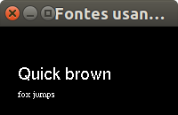

# Escrevendo texto com Freeglut



A letra "F" escrita três vezes, lado a lado.

Características:
  - 2D
  - glOrtho
  - raster
  - texto

## Objetivo

Ilustrar como escrever texto bitmap em OpenGL usando o
utilitário da Freeglut.
Essa forma é bem mais prática do que a oferecida pelo
OpenGL (ver exemplos [fontes-opengl-f][fontes-opengl-f]
e [fontes-opengl][fontes-opengl]), mas ainda não é nada
profissional.

Uma maneira profissional de usar fontes é usando uma
biblioteca como a FreeType para gerar uma textura contendo
todas as letras e, então, desenhar um quadrilátero para cada
uma com sua respectiva região da textura.


[fontes-opengl-f]: ../fontes-opengl-f/
[fontes-opengl]: ../fontes-opengl/

## Descrição

O exemplo contém um módulo `texto` (`texto.c`/`texto.h`) que
exporta a função `escreveTexto(...)`, definida da seguinte
forma:

```c
void escreveTexto(void * fonte, char *texto, float x, float y, float z) {
    int i;
    glRasterPos3f(x, y, z);

    for (i = 0; i < strlen(s); i++) {
        glutBitmapCharacter(font, s[i]);
    }
}
```

A Freeglut possui as funções `glutBitmapCharacter` e
`glutStrokeCharacter` que escrevem um único caractere preenchido
ou apenas seu contorno, respectivamente.

Essas funções recebem os parâmetros:

- `fonte`: qual fonte a Freeglut vai usar para escrever
  o caractere
- `caractere`: caractere a ser escrito

Essas funções da Freeglut usam o `glBitmap` internamente para
escrever texto em uma das seguintes fontes:

- `GLUT_BITMAP_8_BY_13`: fonte monoespaçada de 8 pixels de
  largura
- `GLUT_BITMAP_9_BY_15`: idem, 9 de largura
- `GLUT_BITMAP_TIMES_ROMAN_10`, `GLUT_BITMAP_TIMES_ROMAN_24`:
  variações da fonte _Times New Roman_
- `GLUT_BITMAP_HELVETICA_10`, `GLUT_BITMAP_HELVETICA_12` e
  `GLUT_BITMAP_HELVETICA_18`: variações da fonte Helvetica


### Reaproveitando o módulo `texto`

Você pode pegar o módulo `texto` para o seu projeto. Basta
colocar os arquivos `texto.c`/`texto.h` junto aos arquivos
do seu projeto, incluir o `texto.h` nos arquivos que quiser
e usar a função `escreveTexto(...)` passando seus parâmetros.
