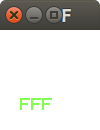
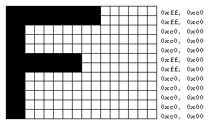

# Escrevendo texto com OpenGL (letra "F")



A letra "F" escrita três vezes, lado a lado.

Características:
  - 2D
  - glOrtho
  - raster
  - texto

## Objetivo

Ilustrar como escrever um bitmap contendo uma letra em OpenGL.
É interessante conhecer essa forma, mas ela não é prática.

Para escrever texto em OpenGL, é mais conveniente usar as
utilidades da Freeglut (ver exemplo [fontes-glut][fontes-glut])
ou então usar alguma biblioteca para carregamento de fontes
do formato TrueType/FreeType e gerar uma textura com todas as
letras.

[fontes-glut]: ../fontes-glut/

## Descrição

O exemplo mostra o texto "FFF" escrito de verde usando a função
`glBitmap`. Sua assinatura é:

```c
glBitmap(width, height, xOffset, yOffset, xMoveCursor, yMoveCursor, array);
```

Essa função desenha o `array` de bytes na posição onde se
encontra o "cursor _raster_" (definido com `glRasterPos2i`).
Os parâmetros são:

- `width, height`: largura e altura do _bitmap_
- `xOffset, yOffset`: quantos pixels saltar dentro do _bitmap_.
  O ponto (0,0) fica no canto esquerdo inferior do _bitmap_
- `xMoveCursor, yMoveCursor`: quantos pixels mover o cursor
  depois de desenhar este _bitmap_. Útil para escrever texto:
  desenha uma letra e salta para a direita para desenhar a
  próxima
- `array`: um vetor de bytes em que cada bit representa se um
  pixel deve ser colorido (1) ou não (0)

Sobre o `array`, o bitmap para desenhar a letra "F" do exemplo
é:



...no código fonte, o vetor de bytes da letra "F" foi
definido como abaixo. Repare que o primeiro byte (`0xc0`)
representa os oito primeiros bits, começando no canto
inferior esquerdo:

```c
// Matriz de pixels que descreve a letra "F".
// Cada item do array é um byte
GLubyte matrizDePixels[24] = {
   0xc0, 0x00,  // 1ª linha, começando de baixo
   0xc0, 0x00,
   0xc0, 0x00,
   0xc0, 0x00,
   0xc0, 0x00,
   0xff, 0x00,
   0xff, 0x00,
   0xc0, 0x00,
   0xc0, 0x00,
   0xc0, 0x00,
   0xff, 0xc0,
   0xff, 0xc0   // Última linha (do alto)
};
```

### Sobre a notação `0xnn`

Em C é possível definir literais numéricas (ie, números escritos
diretamente no código fonte) na base decimal (eg, 192), mas
também nas bases hexadecimal (0xc0<sub>16</sub>), na base
binária (0b11000000<sub>2</sub>) e também na base octal
(0300<sub>8</sub>):

| Número em decimal | Hexadecimal em C | Octal em C | Binário em C |
|------------------:|-----------------:|-----------:|-------------:|
| 192               | `0xc0`           | `0300`     | `0b11000000` |

Quando vamos especificar um _bitmap_, a notação mais fácil de
ler seria a notação binária, uma vez que ela deixa claro o
valor de cada bit. Contudo, é comum preferir a notação mais
sucinta - nesse caso, com apenas dois caracteres (eg, c0) é
possível representar um número binário de oito caracteres
(eg, 11000000). Por esse motivo, o exemplo preferiu usar
a notação hexadecimal.

Se optássemos pela notação binária, o `array` ficaria assim:

```c
// Matriz de pixels que descreve a letra "F".
// Cada item do array é um byte
GLubyte matrizDePixels[24] = {
   0b11000000, 0b00000000,  // 1ª linha, começando de baixo
   0b11000000, 0b00000000,
   0b11000000, 0b00000000,
   0b11000000, 0b00000000,
   0b11000000, 0b00000000,
   0b11111111, 0b00000000,
   0b11111111, 0b00000000,
   0b11000000, 0b00000000,
   0b11000000, 0b00000000,
   0b11000000, 0b00000000,
   0b11111111, 0b11000000,
   0b11111111, 0b11000000   // Última linha (do alto)
};
```

...veja se consegue enxergar a letra "F", mas de cabeça para
baixo.

### Posicionando o _cursor raster_

Tudo que é desenhado com `glBitmap` é desenhado na posição do
_cursor raster_. Para posicionar esse cursor, há os comandos:

```c
glRasterPos2f(x, y);      // move para (x, y, 0)
glRasterPos3f(x, y, z);   // move para (x, y, z)
```

As coordenadas do cursor sofrem as mesmas transformações que
os vértices, ou seja, são multiplicadas pela matriz
`GL_MODELVIEW`, depois pela `GL_PROJECTION`.

Além de poder definir a posição do cursor usando
`glRasterPosXX`, o cursor também é alterado quando `glBitmap`
é invocada com os parâmetros `xMoveCursor` ou `yMoveCursor`
são diferentes de 0.
