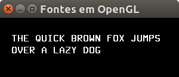

# Escrevendo texto com OpenGL



A frase divertida sobre uma raposa marrom e um _dog_ preguiçoso.
Escrito com `glBitmap`.

Características:
  - 2D
  - glOrtho
  - raster
  - texto

## Objetivo

Ilustrar como escrever um bitmap contendo uma letra em OpenGL.
É interessante conhecer essa forma, mas ela não é prática.

Para escrever texto em OpenGL, é mais conveniente usar as
utilidades da Freeglut (ver exemplo [fontes-glut][fontes-glut])
ou então usar alguma biblioteca para carregamento de fontes
do formato TrueType/FreeType e gerar uma textura com todas as
letras.

[fontes-glut]: ../fontes-glut/

## Descrição

O exemplo mostra o texto "THE QUICK BROWN FOX JUMPS OVER A LAZY DOG" escrito
usando a função `glBitmap`. Sua assinatura é:

```c
glBitmap(width, height, xOffset, yOffset, xMoveCursor, yMoveCursor, array);
```

O funcionamento dessa função e da função para posicionar o
_cursor raster_ estão descritos no exemplo
[fontes-opengl-f][fontes-opengl-f].

[fontes-opengl-f]: ../fontes-opengl-f/


### Curiosidade sobre RAPOSAS E _DOGS_

THE QUICK BROWN FOX JUMPS OVER A LAZY DOG é um pangrama, isto é,
uma frase curta que emprega cada letra do alfabeto pelo
menos uma vez.

Em versões mais antigas do Microsoft Word, você podia digitar
`=rand(5, 10)` e isso expandiria para 5 parágrafos de texto,
cada um contendo a frase sobre RAPOSAS E _DOGS_ 10 vezes.

O uso de pangramas em programas de computador advém da
necessidade de testar a escrita de texto usando diferentes
fontes. ;)
