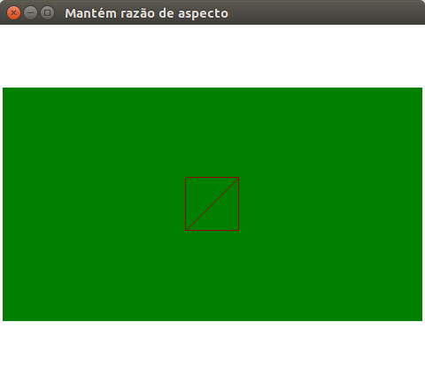
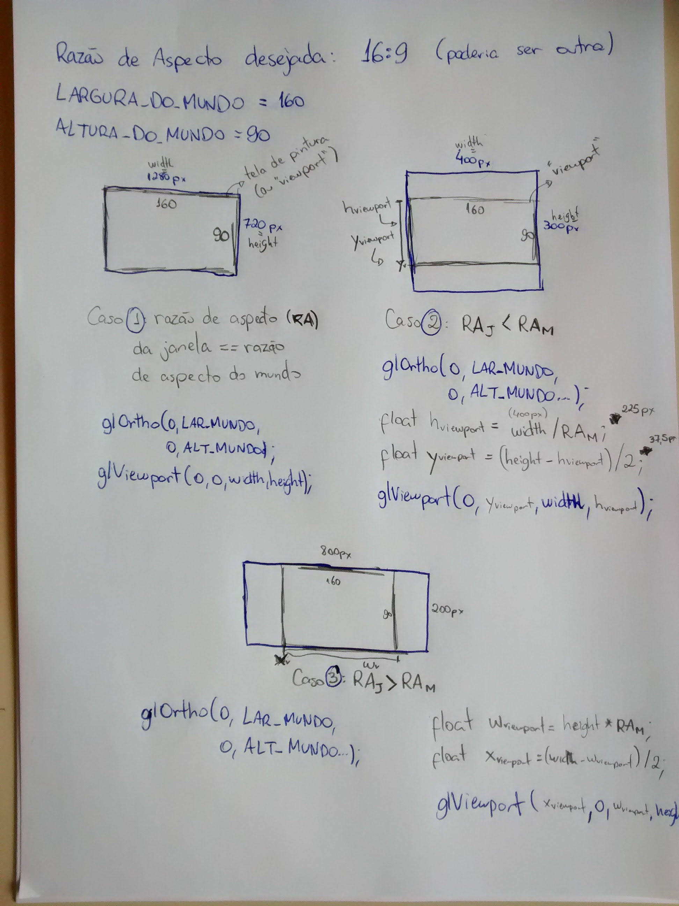

# Mantendo a Razão de Aspecto do Mundo

Para manter a razão de aspecto do mundo e ainda permitir que o usuário
redimensione a janela, há duas possibilidades:

1. Fazer com que o mundo inteiro caiba dentro da janela
1. Fazer com que o mundo ocupe a janela inteira

Este exemplo mostra como (1) fazer com que o mundo inteiro sempre caiba na
janela.



Para isso, fixamos a razão de aspecto ideal do mundo, contra a qual estaremos
utilizando as coordenadas dos objetos da nossa cena. Por exemplo:

```c
#define LARGURA_DO_MUNDO 160
#define ALTURA_DO_MUNDO 90
#define RAZAO_ASPECTO_DO_MUNDO = LARGURA_DO_MUNDO/ALTURA_DO_MUNDO
```

Queremos que os limites do mundo sejam sempre fixos, independente do tamanho
da janela ou de sua razão de aspecto. Nesse caso, podemos usar um `glOrtho(...)`
assim:

```c
glOrtho(0, LARGURA_DO_MUNDO, 0, ALTURA_DO_MUNDO, -1, 1);
```

Contudo, para poder manter o mundo sempre centralizado na janela e também
ocupando o maior espaço possível, precisamos definir a nossa
**janela de pintura** (ou _viewport_) de forma a desenhar em uma subespaço da
janela.

Sendo assim, há três casos:


