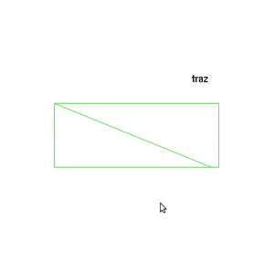
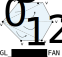

# Orientação de polígonos



Um quadrado rotacionando em torno de X mostrando ora seu lado da frente, ora
o de trás.

Características:
  - 2D
  - glOrtho e glFrustum
  - orientação
  - animação de rotação
  - modo imediatista

## Objetivo

Ilustrar o conceito de orientação de polígonos, que possuem um lado da frente
e outro de trás.
Também mostra a possibilidade de definir modos de preenchimento diferente para
o lado da frente (`GL_FRONT`) e o lado de trás (`GL_BACK`) dos polígonos.

## Descrição

O exemplo mostra um quadrado que fica rotacionando no eixo X mostrando seus
dois lados alternadamente - o da frente e o de trás. Aperte
<key>p</key> para alternar entre projeção ortogonal e
perspectiva (e, então, ver o efeito 3D da rotação).

O OpenGL usa a ordem com que os vértices foram definidos para saber qual
é o lado da frente e qual é o de trás, e isso depende da primitiva geométrica
que está sendo usada. Para o caso de leques de triângulos (`GL_TRIANGLE_FAN`),
se os vértices forem declarados em sentido anti-horário, estaremos vendo o
lado da frente do polígono, como mostrado na imagem pelo sentido da seta:



No exemplo, os vértices foram definidos com suas coordenadas espacialmente
em sentido horário:

```c
// v3--v2
// | ⤴️  |
// v0--v1
glBegin(GL_TRIANGLE_FAN);
    glVertex2i(-30, -30);
    glVertex2i( 30, -30);
    glVertex2i( 30,  30);
    glVertex2i(-30,  30);
glEnd();
```

Tanto os leques quanto as tirinhas de triângulos (`GL_TRIANGLE_STRIP`) possuem
uma orientação consistente dos triângulos gerados. A primitiva de triângulos
(`GL_TRIANGLES`), contudo, não gera triângulos com a mesma orientação
necessariamente. Portanto, deve haver mais cuidado com a ordem de definição
dos vértices de seus triângulos.


