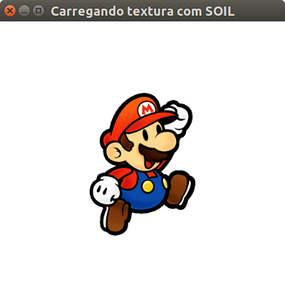

# Textura com SOIL



Um quadrilátero com uma textura do Mario aplicada.

Características:
  - 2D
  - glOrtho
  - texturas
  - SOIL
  - transparência
  - modo imediatista

## Objetivo

Mostrar como aplicar uma textura retangular a um retângulo.

## Descrição

O exemplo mostra um desenho do Mario na janela. Na verdade, foi desenhado
um quadrado (usando `GL_TRIANGLE_FAN`) e nele foi aplicada uma textura
do Mario.

A textura aplicada possui transparência - apenas a parte que tem o Mario é
visível. Mas existe um quadrado onde ela foi aplicada, ele apenas não aparece.

Para usar a SOIL para aplicar texturas, 3 passos devem ser seguidos:
1. Incluir a biblioteca:
   - O arquivo `SOIL.h` deve ser incluído pelo arquivo que for usar
     a função para carregar textura (`SOIL_load_OGL_texture(...)`)
   - Na hora de compilar, tanto o cabeçalho quanto o arquivo de biblioteca
     (`libSOIL.a`) deve estar acessíveis para o compilador. Veja
     [usando a SOIL em um programa em C/C++](#usando-a-soil-em-um-programa)
     para mais detalhes
1. Carregar uma textura de uma imagem no formato `.png` ou `.jpg`:
   ```c
   int idTextura = SOIL_load_OGL_texture(
      "arquivo",
      SOIL_LOAD_AUTO,
      SOIL_CREATE_NEW_ID,
      SOIL_FLAG_INVERT_Y
   );
   ```
   - É importante que o carregamento do arquivo de textura seja feito apenas
     uma vez (não faça isso várias vezes por segundo, vai ficar MEGA pesado)
1. Usar a textura ao desenhar:
   ```c
   glEnable(GL_TEXTURE_2D);       // usa a textura para tudo o que for desenhado
   glBindTexture(idTextura);      // escolhe a textura para usar
   glBegin(GL_TRIANGLE_FAN);
      glTexCoord2f(0, 0);         // associa o canto esq-inf para v0
      glVertex3f(...)
      // ...
   glEnd();
   glDisable(GL_TEXTURE_2D);
   ```
### Sobre transparência de texturas

Para que a transparência que está no arquivo da textura funcione (o Mario
não "tem um fundo"), é necessário habilitar a mesclagem do OpenGL. Para isso,
em uma função de inicialização, escrevemos:

```c
// habilita mesclagem de cores, para termos suporte a texturas
// com transparência
glEnable(GL_BLEND);
glBlendFunc(GL_SRC_ALPHA, GL_ONE_MINUS_SRC_ALPHA);
```

PNG, GIF e JPG são os formatos de arquivo mais comuns e seu suporte a
transparência é:
- PNG: cada pixel pode ter transparência e ela pode possuir intensidade de
  8bits (0 é transparente, 255 é opaco)
- GIF: transparência binária (apenas 1bit)
- JPG: não é possível ter transparência

### Usando a SOIL em um programa

A SOIL é composta por um arquivo de cabeçalho (`SOIL.h`) e um arquivo de
biblioteca (`libSOIL.a`). Para usá-la, o `SOIL.h` deve estar acessível
ao compilador¹ (em alguma pasta que ele conheça), assim como o `libSOIL.a`
deve estar acessível quando da etapa de ligação².

¹Para tornar `SOIL.h` acessível ao compilador, há 03 formas:
1. Coloque o `SOIL.h` dentro da pasta `include` onde o compilador procura
   por arquivos para inclusão.
   - No Windows, usando CodeBlocks, essa pasta costuma ser
     `C:\Arquivos de programas\CodeBlocks\MinGW\include\SOIL` ou
     `C:\Arquivos de programas\CodeBlocks\MinGW\include`
     - Aí seu programa usaria `#include <SOIL/SOIL.h>` ou `#include <SOIL.h>`
   - Desta forma você está "instalando" a SOIL no seu computador
1. Coloque o `SOIL.h` junto com seu projeto.
   - Aí seu programa usaria `#include "SOIL."`
1. Deixe o `SOIL.h` em alguma pasta do seu computador e, ao compilar,
   use uma opção do compilador para especificar um local para ele procurar
   por arquivos de cabeçalho.
   - Supondo que existe uma pasta `SOIL` na área de trabalho, você poderia
     compilar assim:
     ```
     gcc main.c -c main.o -IC:\Users\User\Desktop\SOIL
     ```
     - Aí seu programa usuaria `#include <SOIL.h>`
   - **Problema**: desta forma o programa só vai compilar no computador que
     tiver a SOIL na área de trabalho

²Para tornar `libSOIL.a` acessível à etapa de ligação do compilador, formas
semelhantes estão disponíveis:
1. Coloque `libSOIL.a` na pasta `lib` onde o compilador procura por arquivos
   de bibliotecas.
   - Desta forma você está "instalando" a SOIL no seu computador
   - Para compilar e gerar o arquivo executável do programa, você deve
     pedir o computador para considerar o `libSOIL.a` como uma biblioteca
     usada pelo seu programa, da seguinte forma:
     ```
     gcc main.o -o main -lSOIL -lGL
     ```
     ...no Linux e:
     ```
     gcc main.o -o main -lSOIL -lopengl32
     ```
     ...no Windows.
1. Coloque `libSOIL.a` dentro de uma pasta `bibliotecas` dentro do seu projeto,
   ou em algum outro lugar do computador (pior) e instrua o compilador
   a encontrá-la:
   ```
   gcc main.o -o main -lbibliotecas -lGL
   ```
   - Caso a pasta `bibliotecas` não esteja dentro do projeto, troque
     `-lbibliotecas` por `-lCAMINHO_PARA_PASTA`. Para Windows, em vez de
     usar `-lGL`, use `-lopengl32`
